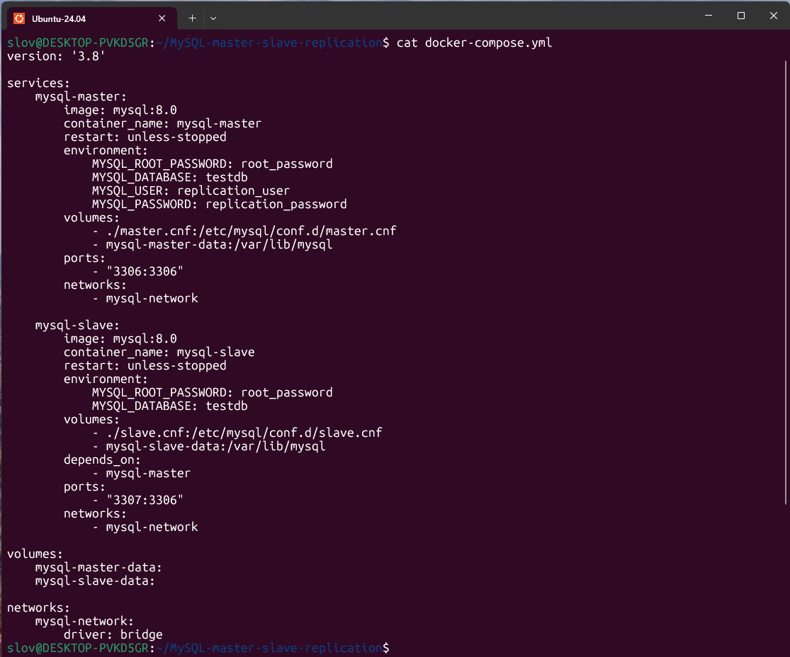
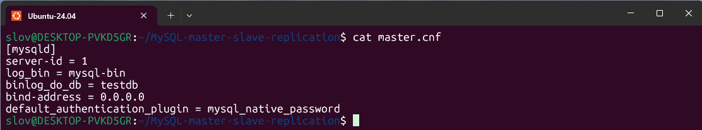
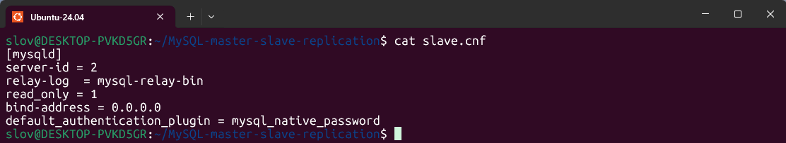
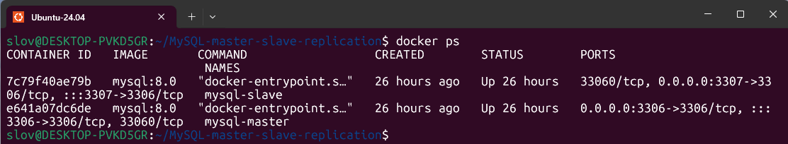
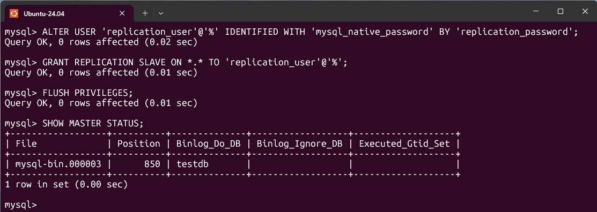
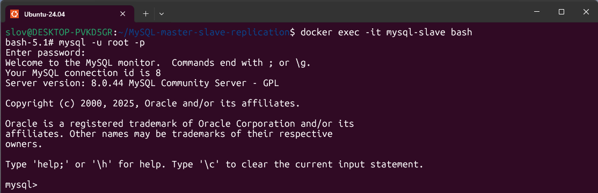
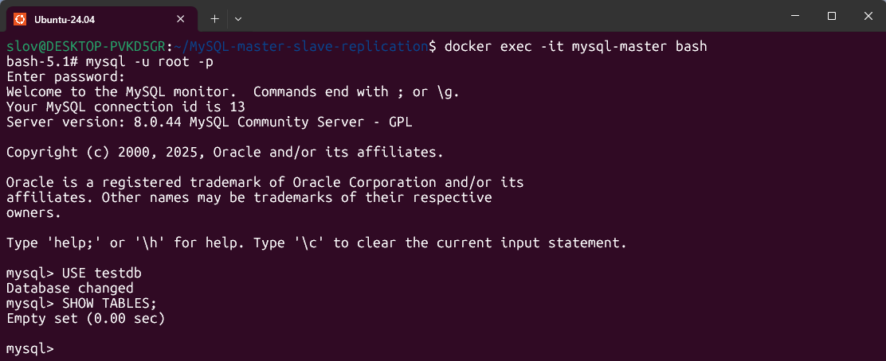
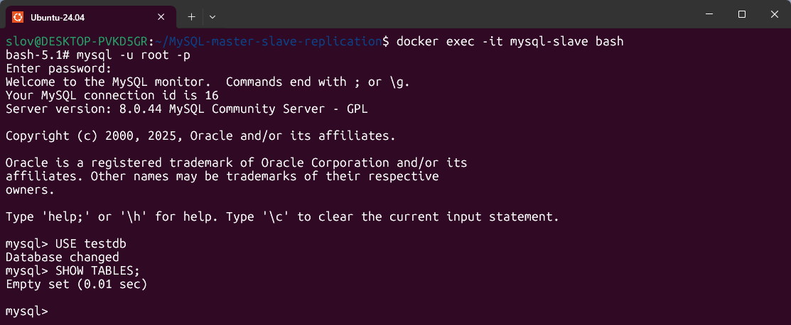
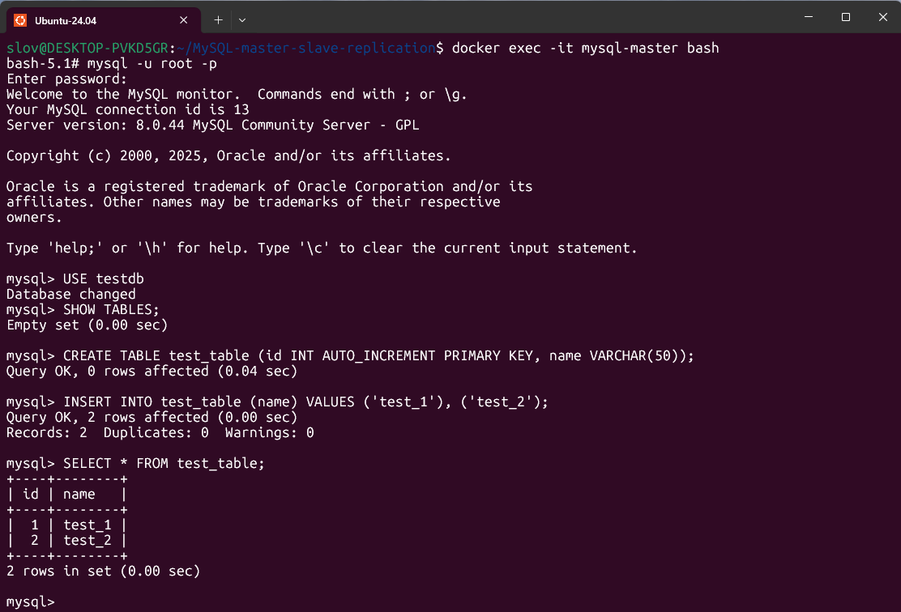
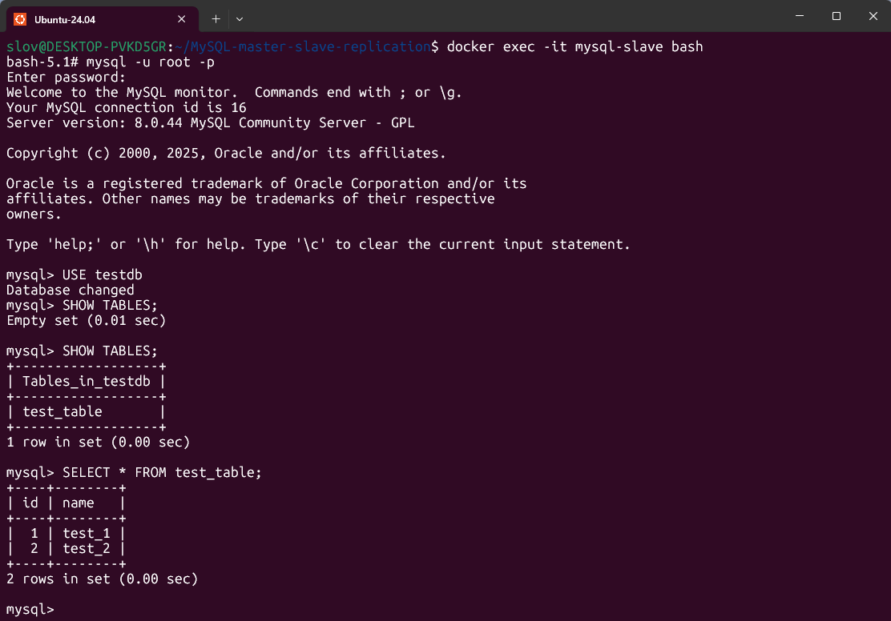

# Домашнее задание к занятию "`Репликация и масштабирование. Часть 1`" - `Рахманов Александр`


### Инструкция по выполнению домашнего задания

   1. Сделайте `fork` данного репозитория к себе в Github и переименуйте его по названию или номеру занятия, например, https://github.com/имя-вашего-репозитория/git-hw или  https://github.com/имя-вашего-репозитория/7-1-ansible-hw).
   2. Выполните клонирование данного репозитория к себе на ПК с помощью команды `git clone`.
   3. Выполните домашнее задание и заполните у себя локально этот файл README.md:
      - впишите вверху название занятия и вашу фамилию и имя
      - в каждом задании добавьте решение в требуемом виде (текст/код/скриншоты/ссылка)
      - для корректного добавления скриншотов воспользуйтесь [инструкцией "Как вставить скриншот в шаблон с решением](https://github.com/netology-code/sys-pattern-homework/blob/main/screen-instruction.md)
      - при оформлении используйте возможности языка разметки md (коротко об этом можно посмотреть в [инструкции  по MarkDown](https://github.com/netology-code/sys-pattern-homework/blob/main/md-instruction.md))
   4. После завершения работы над домашним заданием сделайте коммит (`git commit -m "comment"`) и отправьте его на Github (`git push origin`);
   5. Для проверки домашнего задания преподавателем в личном кабинете прикрепите и отправьте ссылку на решение в виде md-файла в вашем Github.
   6. Любые вопросы по выполнению заданий спрашивайте в чате учебной группы и/или в разделе “Вопросы по заданию” в личном кабинете.
   
Желаем успехов в выполнении домашнего задания!
   
### Дополнительные материалы, которые могут быть полезны для выполнения задания

1. [Руководство по оформлению Markdown файлов](https://gist.github.com/Jekins/2bf2d0638163f1294637#Code)

---

## Решение

### Задание 1

На лекции рассматривались режимы репликации master-slave, master-master, опишите их различия.

*Ответить в свободной форме.*


Режим репликации `master-slave` подразумевает, что все активные действия с базой (добавление, обновление, удаление) производятся на `master`, куда поступают все данные. `Slave` используется только для чтения данных, которые скопированы с `master`. Это позволяет распределить нагрузку на базу данных между несколькими серверами или репликами.

Режим `master-master` - это режим, при котором каждый из серверов кластера базы данных выполняет роль и `master`, и `slave`. Эта конфигурация добавляет избыточность и повышает эффективность при обращении к данным.

Режим `master-slave` проще в настройке. `master-master` сложнее из-за возможных конфликтов.

---

### Задание 2

Выполните конфигурацию master-slave репликации, примером можно пользоваться из лекции.

*Приложите скриншоты конфигурации, выполнения работы: состояния и режимы работы серверов.*

1. Конфигурационные файлы master-slave репликации.










2. Запуск контейнеров.

```
docker compose up -d
docker ps
```


3. Подключение к мастер-серверу.

```
docker exec -it mysql-master bash
mysql -u root -p
```


4. Настройка master-сервера.

```
ALTER USER 'replication_user'@'%' IDENTIFIED WITH 'mysql_native_password' BY 'replication_password';
GRANT REPLICATION SLAVE ON *.* TO 'replication_user'@'%';
FLUSH PRIVILEGES;
SHOW MASTER STATUS;
```


5. Подключение к slave-серверу.

```
docker exec -it mysql-slave bash
mysql -u root -p
```


6. Настройка и запуск репликации на slave-сервере.

```
CHANGE MASTER TO  MASTER_HOST='mysql-master',MASTER_USER='replication_user',MASTER_PASSWORD='replication_password', MASTER_LOG_FILE='mysql-bin.000003',MASTER_LOG_POS=850;
START SLAVE;
SHOW SLAVE STATUS\G
```


7. Тестирование репликации.

На master-сервере входим в базу данных и убеждаемся, что она пуста:

```
USE testdb;
SHOW TABLEs;
```


На slave-сервере входим в базу данных и убеждаемся, что база пуста, как и на master-сервере:

```
USE testdb;
SHOW TABLEs;
```


На master-сервере создаём таблицу и наполняем её значениями:

```
CREATE TABLE test_table (id INT AUTO_INCREMENT PRIMARY KEY, name VARCHAR(50));
INSERT INTO test_table (name) VALUES ('test_1'), ('test_2');
SELECT * FROM test_table;
```


Убеждаемся, что репликация работает - заполненная таблица появилась на slave-сервере:

```
SHOW TABLES;
SELECT * FROM test_table;
```


---
